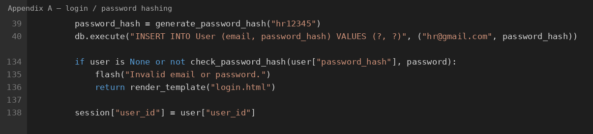
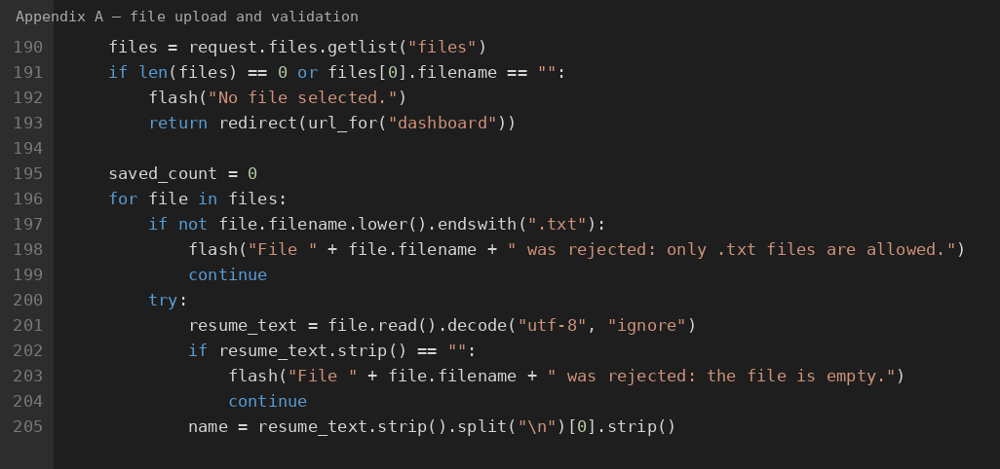
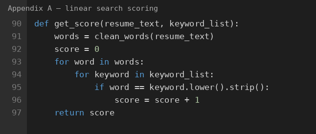
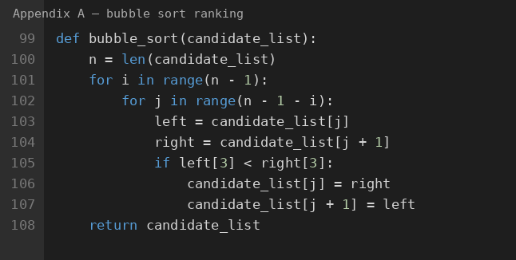
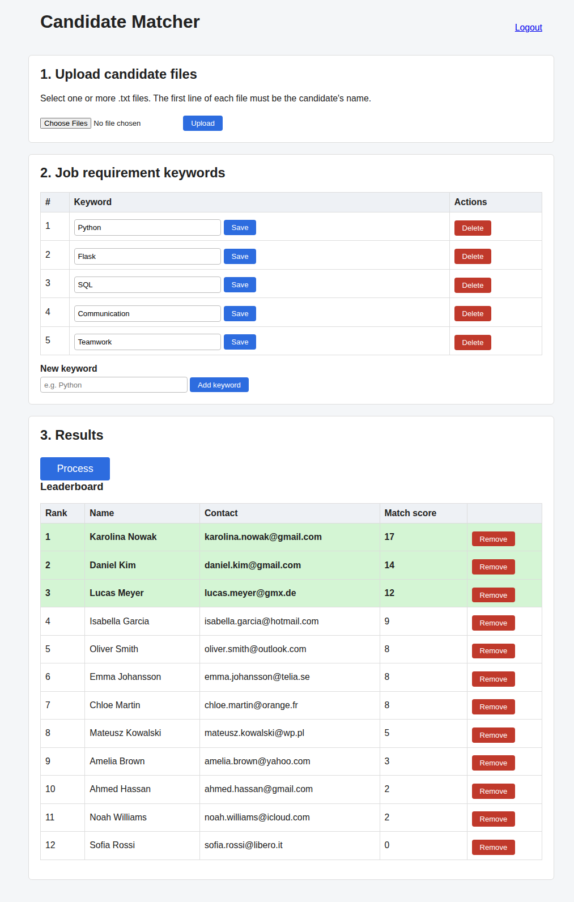
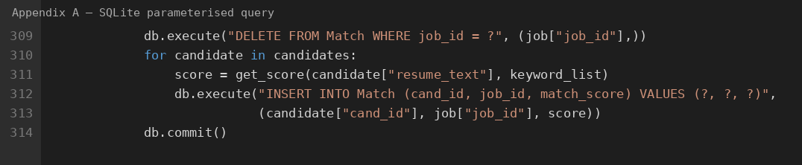
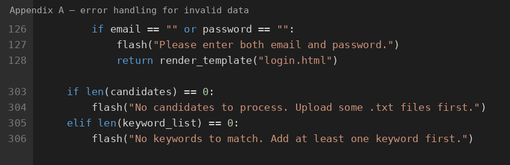
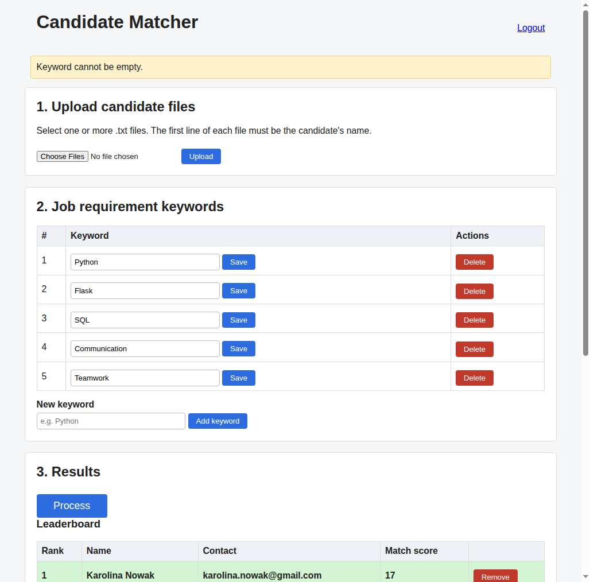
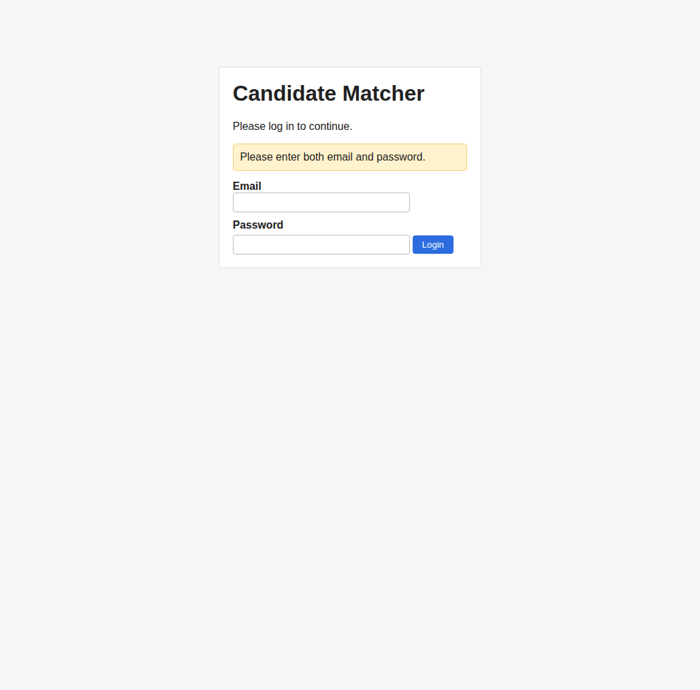

# Criterion D – Development

This section shows the main techniques used to build the Candidate Matcher. For each technique I include a short code excerpt, explain what it does, justify why I chose it, and link it to the success criteria. Full source code is in **Appendix A** (`APPENDIX_SOURCE_CODE.txt`). Line numbers below match that file. The appendix is comment-free.

---

## 1. Password hashing and login

*See Appendix A, lines 39–40 and 134–138.*

The first technique hashes the HR password before it is stored in SQLite, and checks it again at login. `generate_password_hash()` turns `"hr12345"` into a long scrambled string, so the real password is never saved as plain text. At login, `check_password_hash()` compares the typed password with the stored hash. If the email is missing or the password is wrong, an error is shown and the user stays on the login page. If the match is successful, `session["user_id"]` remembers who is logged in.

I chose password hashing instead of storing the password in plain text because login data is sensitive. Even if somebody opened the SQLite file, they would only see the hash. Flask sessions are also better than sending the password on every page, because only the user id is kept after a successful login. This supports **SC-01**. Observed results for T-01–T-03 are in the table below.

---

## 2. File reading and upload validation

*See Appendix A, lines 190–205.*

This excerpt shows how LinkedIn text enters the system. `request.files.getlist("files")` receives one or many files in one submission. The code checks that a file was selected, then that each name ends with `.txt`. Invalid types are rejected with a flash message and are not stored. For a valid file, `.read()` loads the text and the candidate name is taken from the first line.

I chose simple `.txt` files rather than PDF or a LinkedIn API because Python can process them with basic string methods, and my client can copy profile text without complex formatting. Checking the extension before saving stops wrong files from entering the Candidate table. Using `getlist()` also allows 10 or more files at once. This links to **SC-02** and **SC-08**.

A limitation is that only the extension is checked, not the real content type, but for this IA that is enough. T-05 and T-06 confirm that a PDF and a missing file both show clear errors.

---

## 3. Linear search for match scoring

*See Appendix A, lines 90–97.*

`get_score()` is the matching algorithm from Flowchart_5. First `clean_words()` turns the resume into lower-case words and removes punctuation, so `"Python,"` and `"python"` match. Then a nested loop compares every resume word with every keyword. Each equal pair adds 1 to the score. The final score is stored in the Match table and shown next to the candidate name.

I chose linear search because the resume text is not sorted, so binary search cannot be used. Linear search is simple to implement and explain, and it matches the plan in Criterion A. For a few hundred resume words and only five keywords, O(n × m) is fast enough for about 10–50 candidates. A NLP library could give smarter matches, but it would hide the algorithm. This supports **SC-05**.

Scoring was tested with different keyword hit counts, including a zero-score candidate (Sofia Rossi scored 0). Invalid Process cases are blocked before `get_score()` runs.

---

## 4. Bubble sort for the leaderboard

*See Appendix A, lines 99–108.*

After scoring, `bubble_sort()` ranks candidates. Nested loops compare neighbours and swap them if the left score (`left[3]`) is lower than the right score, so the list ends highest to lowest. The dashboard shows this list and highlights the first three rows in green with the `top-three` CSS class.

I chose bubble sort because the list is small (about 10–50 people), so O(n²) is acceptable, and it sorts in place with almost no extra memory. That fits better here than merge sort, which needs extra arrays. Python’s built-in `sorted()` would be shorter, but I wrote bubble sort myself so the ranking algorithm is visible. This links to **SC-06** and **SC-07**.

*Figure: Observed leaderboard after Process (T-13, T-14, T-15). Top three rows are green; scores go from 17 down to 0.*

---

## 5. SQLite parameterised queries

*See Appendix A, lines 309–314.*

When Process is clicked, old Match rows for the job are deleted, then each score is inserted with a parameterised SQL statement. The `?` placeholders are filled with `cand_id`, `job_id` and `match_score`. `db.commit()` saves the changes so scores remain after the browser is closed.

I chose SQLite with `?` parameters instead of building SQL with `+` because parameters are safer and clearer. SQLite is a single file, needs no separate server, and matches the Criterion C design. Persistent storage keeps data after logout, which supports **SC-05** and **SC-07**. A limitation is that SQLite is not ideal for many users at once, but this product is for one HR client.

---

## 6. Error handling for invalid data

*See Appendix A, lines 126–128 and 303–306.*

Error handling is used across login, upload, keywords and Process. Empty fields, wrong passwords, non-`.txt` files, empty or duplicate keywords, and Process with missing data all show a flash message instead of crashing. File reading is also in `try/except` so a broken file does not stop the whole upload loop.

I chose flash messages with early `return` / `continue` because they keep the HR on a familiar page and explain what went wrong. This is more useful than a Python traceback and makes the Criterion C negative tests possible.

*Figure: Invalid data — uploading `resume.pdf` shows “only .txt files are allowed” (T-05).*

*Figure: Invalid data — empty keyword shows “Keyword cannot be empty” (T-08b).*

*Figure: Invalid data — wrong password shows “Invalid email or password” (T-02).*

---

## Test evidence (Observed Results)

Tests follow the Criterion C plan (Chrome; `hr@gmail.com` / `hr12345`; files in `sample_cvs/`).

| Test ID | SC | Description | Test Data | Observed Results |
|---|---|---|---|---|
| T-01 | SC-01 | Valid login | hr@gmail.com / hr12345 | Redirected to Dashboard. |
| T-02 | SC-01 | Invalid password | wrong123 | Error: “Invalid email or password.” Stayed on login. |
| T-03 | SC-01 | Empty login fields | empty | Error: “Please enter both email and password.” |
| T-04 | SC-02 | Valid .txt upload | 01_Karolina_Nowak.txt | File accepted; Karolina Nowak appears. |
| T-05 | SC-02 | Invalid file type | resume.pdf | Error: “only .txt files are allowed.” Not stored. |
| T-06 | SC-02 | No file selected | none | Error: “No file selected.” |
| T-07 | SC-08 | 10+ uploads | 12 .txt files | 12 candidates present after upload. |
| T-08 | SC-03 | Add keyword | Python | Keyword Python appears in the list. |
| T-08b | SC-03 | Empty keyword | empty string | Error: “Keyword cannot be empty.” |
| T-09b | SC-04 | Duplicate keyword | python (duplicate) | Error: keyword already in the list. |
| T-11 | SC-05 | Match scores | 12 candidates + 5 keywords | Name and score shown for each candidate. |
| T-12 | SC-05 | Process, no candidates | none | Error: “No candidates to process.” No crash. |
| T-12c | SC-05 | Process, no keywords | candidates only | Error: “No keywords to match.” |
| T-13 | SC-06 | Sorting | 12 scores | Descending order (17, 14, 12, 9, 8, …, 0). |
| T-14 | SC-07 | Leaderboard | full workflow | Numbered list of 12 candidates with scores. |
| T-15 | SC-07 | Top 3 highlight | ≥4 candidates | Ranks 1–3 highlighted in green. |

The strategy covers normal, abnormal and extreme data. One limitation is that bubble sort is checked through the final on-screen order, not a printout of every swap.

---

## AI (LLM) acknowledgment

An AI coding assistant (LLM) helped with Flask setup, debugging some upload/validation edge cases, and drafting notes for this Criterion D write-up. The main algorithm choices (linear search and bubble sort), the SQLite design, and the final wording were reviewed and decided by me. The same acknowledgment is in a short note at the top of the development file `app.py`. Appendix A itself is comment-free code only.

---

## Appendix reference

All excerpts refer to **Appendix A** (`APPENDIX_SOURCE_CODE.txt`). Screenshots used above are in `docs/criteria_d/screenshots/` and show the same comment-free lines.
